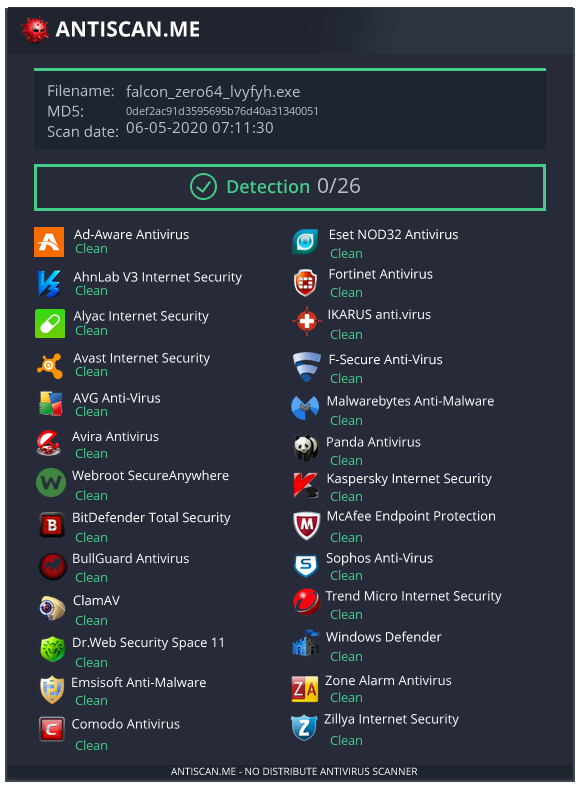

# FalconZero
[]() []() []() [](https://GitHub.com/Naereen/)

Introducing FalconZero v1.0 - a stealthy, targeted Windows Loader for delivering second-stage payloads(shellcode) to the host machine undetected.

<p align="center">
  
</p>

## Features
- [X] Dynamic shellcode execution
- [X] Usage of Github as the payload storage area - the payload is fetched from Gthub
- [X] Targeted implant Loader - only execute on targeted assets - thwart automated malware analysis hinder reverse engineering
- [X] Killdates - implant expires after a specific date
- [X] Stealthy shellcode injection technique without allocating RWX mempry pages in host process to evade AV/EDRs
- [X] Sensitive strings encrypted using XOR

## Usage
There are many hard things in life but generating an implant shouldn't be one. This is the reason the `generate_implant.py` script has been created to make your life a breeze.
The process is as simple as:
```
git clone https://github.com/slaeryan/FALCONSTRIKE.git
cd FALCONSTRIKE
pip3 install -r requirements.txt
python3 generate_implant.py
```
Follow the on-screen instructions and you'll find the output in `bin` directory if everything goes well.

## AV Scan of _FalconZero_ implant


## TO-DO
This is an alpha release version and depending on the response many more upgrades to existing functionalities are coming soon.

Some of them are:

- [ ] Integrate various Sandbox detection algorithms
- [ ] Integrate support for more stealthy shellcode injection techniques
- [ ] Integrate function obfuscation to make it stealthier
- [ ] Include a network component to callback to a C2 when a Stage-2 payload is released or to change targets/payloads and other options on-the-fly etc.

Feel free to communicate any further feature that you want to see in the next release. Suggestions for improving existing features are also warmly welcome :)

## Read more
[](https://slaeryan.github.io/posts/falcon-zero-alpha.html)

## Author
Upayan ([@slaeryan](https://twitter.com/slaeryan)) [[slaeryan.github.io](https://slaeryan.github.io)]

## License
All the code included in this project is licensed under the terms of the GNU AGPLv3 license.

#

[](https://slaeryan.github.io) [](https://twitter.com/slaeryan) [](https://www.linkedin.com/in/upayan-saha-404881192/)